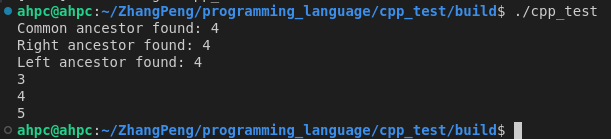
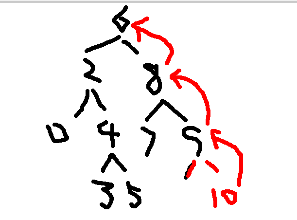
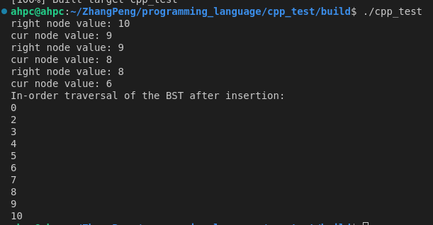
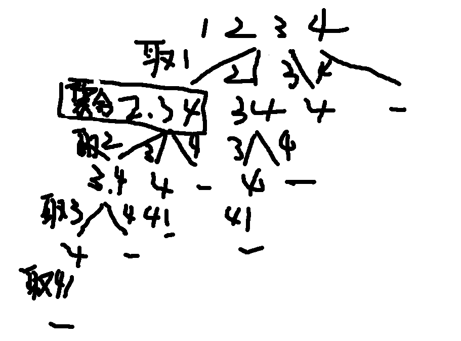
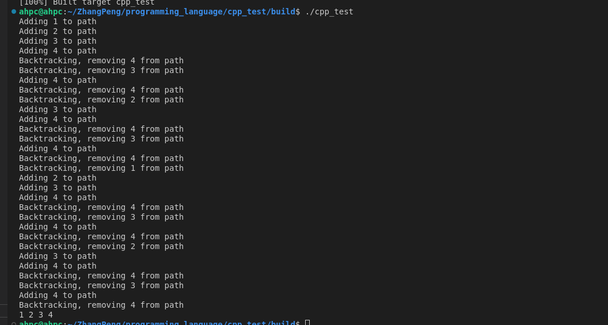
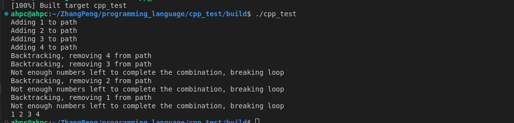

# programming_language
C++/ python
1、时间复杂度参考
参看文档[时间复杂度](./leetcode-master/problems/前序/时间复杂度.md)和[算法的时间与空间复杂度](https://zhuanlan.zhihu.com/p/50479555)
2、列表操作
- 在列表增删改查的第n个节点的时候用虚拟投节点的时候是操作cur->next（因为dummyHead指向的是cur）;
- 在列表插入第n个节点的时候，注意是先操作右边再操作左边（反之 dummyHead->next = newNode ;由于dummyHead->next指向被覆盖，newNde->next无法之前dummyHead->next的指向）
```CPP
class MyLinkedList {
public:
    struct ListNode
    {
        int val;
        ListNode* next;
        //一般写成对构造函数进行重载
		ListNode(int x):val(x),next(NULL){};
    };
    MyLinkedList() {
        //需要一开始的时候就定义虚拟头节点
        dummyHead = new ListNode(0);
        size = 0;
    }
    
    int get(int index) {
        if(index < 0 || index > size)
        {
            return -1;
        }
        //在列表增删改查的第n个节点的时候用虚拟投节点的时候是操作cur->next（因为dummyHead指向的是cur）
        ListNode* cur = dummyHead;
        while(index)
        {
            cur = cur->next;
            index--;
        }
        
        int tempVal = cur->next->val;

        return tempVal;
    }
    
    void addAtHead(int val) {

        //推荐这种写法
        ListNode* newNode = new ListNode(val);
        //在列表插入第n个节点的时候，注意是先操作右边再操作左边
        newNode->next = dummyHead->next;
        dummyHead->next = newNode;

		std::cout<<"dummyHead->next->val:"<<dummyHead->next->val<<std::endl;
		std::cout<<"dummyHead->next->next:"<<dummyHead->next->next<<std::endl;
        size++;
    }
    
    void addAtTail(int val) {

        ListNode* cur = dummyHead;
        while(cur->next != NULL)
        {
            cur = cur->next;
        }

        ListNode* newNode = new ListNode(val);
        //另外一种表达就是cur->next指向newNode
        cur->next = newNode;

        size++;
    }
    
    void addAtIndex(int index, int val) {
        if(index > size)
           return;

        ListNode* cur = dummyHead;
        while(index)
        {
            cur = cur->next;
            index--;
        }

        ListNode* newNode = new ListNode(val);

        newNode->next = cur->next;
        cur->next = newNode;
        
        size++;
    }
    
    void deleteAtIndex(int index) {
        if(index < 0 || index > size)
        {
            return;
        }

        ListNode* cur = dummyHead;
        while(index)
        {
            cur = cur->next;
            index--;
        }
        
        ListNode* tempNode = cur->next;
        cur->next = cur->next->next;
        delete tempNode;

        size--;
    }
	void printList() {
		ListNode* cur = dummyHead;
		while(cur->next != NULL)
		{
			std::cout << cur->next->val << " ";
			cur = cur->next;
		}
		std::cout << std::endl;
	}

	~MyLinkedList() {
		ListNode* cur = dummyHead;
		while(cur != NULL)
		{
			ListNode* temp = cur;
			cur = cur->next;
			delete temp;
		}
	}
private:
    ListNode* dummyHead;
    int size;
};

/**
 * Your MyLinkedList object will be instantiated and called as such:
 * MyLinkedList* obj = new MyLinkedList();
 * int param_1 = obj->get(index);
 * obj->addAtHead(val);
 * obj->addAtTail(val);
 * obj->addAtIndex(index,val);
 * obj->deleteAtIndex(index);
 */
```   
二叉树的遍历    


```C++
#include <iostream>
#include <string>
#include <sstream>

using namespace std;

// 定义二叉树节点
struct TreeNode {
    string val;
    TreeNode* left;
    TreeNode* right;
    TreeNode(const string& x) : val(x), left(nullptr), right(nullptr) {}
};

// 从输入流中递归构建二叉树（先序）
TreeNode* buildTree(istringstream& iss) {
    string val;
    if (!(iss >> val)) return nullptr;
    if (val == "#") return nullptr;

    TreeNode* node = new TreeNode(val);
    node->left = buildTree(iss);
    node->right = buildTree(iss);
    return node;
}

// 中序遍历
void inorder(TreeNode* root) {
    if (root) {
        inorder(root->left);
        cout << root->val << " ";
        inorder(root->right);
    }
}

// 释放内存
void freeTree(TreeNode* root) {
    if (root) {
        freeTree(root->left);
        freeTree(root->right);
        delete root;
    }
}

int main() {
    cout << "请输入二叉树的先序遍历（空节点用 # 表示，空格分隔）：\n";
    string input;
    getline(cin, input);
    istringstream iss(input);

    TreeNode* root = buildTree(iss);
    cout << "构建成功！中序遍历结果为：\n";
    inorder(root);
    cout << endl;

    freeTree(root);  // 防止内存泄漏
    return 0;
}

```
验证二叉搜索树
中序遍历下，输出的二叉搜索树节点的数值是有序序列
```C++
class Solution {
public:
    TreeNode* pre = NULL;
    bool isValidBST(TreeNode* root) {
        if(root == NULL)  return true;
        bool left_valid = isValidBST(root->left);
   
        std::cout<<"root->val: "<<root->val<<std::endl;
        if(pre != NULL && pre->val >= root->val) 
        {
            std::cout<<"pre->val: "<<pre->val<<" root->val："<<root->val<<std::endl;
            return false;
        }
        pre = root;


        bool right_valid = isValidBST(root->right);
        std::cout<<"left_valid: "<<left_valid<<" right_valid: "<<right_valid<<" root->val:"<<root->val<<std::endl;
        return left_valid&right_valid;
    }
};
int main()
{
    Solution s;
    TreeNode* root = new TreeNode(5);   
    root->left = new TreeNode(1);   
    root->right = new TreeNode(7);  
    // root->left->left = new TreeNode(4);
    // root->left->right = new TreeNode(5);    
    root->right->left = new TreeNode(3);            
    root->right->right = new TreeNode(6);   
    bool is_valid = s.isValidBST(root);
    return 0;
}/*  */
```
示意图   

输出left_valid和right_valid的回溯过程


二叉搜索树的插入与公共祖先问题 
```C++
class Solution {
public:
    
    //递归与回溯
    TreeNode* insertBinarySearchTree(TreeNode* root, int val) {
        if (root == NULL) {
            return new TreeNode(val);
        }
        if (val < root->val) {
            root->left = insertBinarySearchTree(root->left, val);
            std::cout<<"left node value: "<<root->left->val<<std::endl;
        } else {
            root->right = insertBinarySearchTree(root->right, val);
            std::cout<<"right node value: "<<root->right->val<<std::endl;
        }
        if(root!=NULL)
        {
            std::cout<<"cur node value: "<<root->val<<std::endl;
        }
        return root;

    }
    TreeNode* findCommonAncestor(TreeNode* root,int p, int q) {
        if (root == NULL) return NULL;
        if (root->val == p || root->val == q) return root;
        
        if(p < root->val && q < root->val) {
            TreeNode* leftAncestor = findCommonAncestor(root->left, p, q);
            if(leftAncestor!= NULL) {
                std::cout<<"Left ancestor found: " << leftAncestor->val << std::endl;
            } else {
                std::cout<<"Left ancestor not found."<<std::endl;
            }
            return leftAncestor;
        } else if (p > root->val && q > root->val) {
            TreeNode* rightAncestor = findCommonAncestor(root->right, p, q);
            if(rightAncestor!= NULL) {
                std::cout<<"Right ancestor found: " << rightAncestor->val << std::endl;
            } else {
                std::cout<<"Right ancestor not found."<<std::endl;
            }
            return rightAncestor;
        } 

        std::cout << "Common ancestor found: " << root->val << std::endl;
        return root; // This is the common ancestor
        
    }
    void InOrderTraversal(TreeNode* root) {
        if (root == NULL) return;
        InOrderTraversal(root->left);
        std::cout << root->val << " "<<std::endl;
        InOrderTraversal(root->right);
    }
};
int main()
{
    Solution s;
    //6,2,8,0,4,7,9,null,null,3,5
    TreeNode* root = new TreeNode(6);   
    root->left = new TreeNode(2);   
    root->right = new TreeNode(8);  
    root->left->left = new TreeNode(0);
    root->left->right = new TreeNode(4);    
    root->right->left = new TreeNode(7);            
    root->right->right = new TreeNode(9); 

    root->left->right->left = new TreeNode(3);
    root->left->right->right = new TreeNode(5); 

    int val = 5;
    //TreeNode* ancestor_node = s.insertBinarySearchTree(root,val);
    //std::cout << "In-order traversal of the BST after insertion: "; 
    TreeNode* ancestor_node = s.findCommonAncestor(root, 3, 5);
    s.InOrderTraversal(ancestor_node);
    return 0;
}
```
主要区别在return上
- 当找到公共祖先的时候，会把公共祖先树通过回溯return上去        

- 在插入节点的时候，走常规回溯return上去



回溯算法
```C++
class Solution {
public:
    vector<int> path;
    vector<vector<int>> res;
    void backTracking(int targetSum,int sum,int k ,int startIndex) //确定函数返回值和参数
    {
        //std::cout<<"startIndex: " << startIndex << ", current path size: " << path.size() << endl;
        if (k == path.size()) {//终止条件
            if(targetSum == sum){
                res.push_back(path);//存放结果
            }
            return;
        }
        //std::cout<<"startIndex: " << startIndex  << endl;
        for (int i = startIndex; i <= 9; ++i) {//元素《==从集合中选择
            if(sum + i > targetSum) {
                // If the current sum exceeds the target, no need to continue
                std::cout << "Current sum " << sum << " with adding " << i << " exceeds target " << targetSum << endl;
                break;
            }
            std::cout << "Adding " << i << " to path" << endl;
            path.push_back(i);
            sum += i; // Update the sum with the current number  //处理节点
            backTracking(targetSum,sum, k, i + 1); // Move to the next number //递归
            path.pop_back(); // Backtrack  //回溯
            sum-= i; // Update the sum by removing the current number
            std::cout << "Backtracking, removing " << i << " from path" << endl;
        }
    }

};
int main()
{
    Solution s;
    int n = 4, k = 4;
    s.backTracking(n, k, 1);
    for (const auto& combination : s.res) {
        for (int num : combination) {
            cout << num << " ";
        }
        cout << endl;
    }
    return 0;
}
```
树状图如下(先执行递归，后for循环)：

程序执行如下图：

剪枝程序如下图
