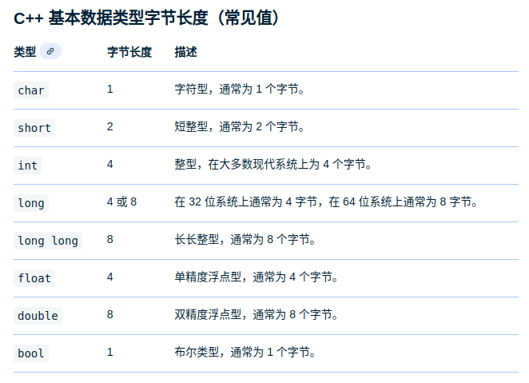

# 常见C++面试题及基本知识点总结
- [常见C++面试题及基本知识点总结](#常见c面试题及基本知识点总结)
  - [结构体和共同体的区别](#结构体和共同体的区别)
    - [常见数据类型及其长度：](#常见数据类型及其长度)
    - [总结](#总结)
  - [static 和const分别怎么用](#static-和const分别怎么用)
    - [static的作用：](#static的作用)
      - [修饰局部变量](#修饰局部变量)
      - [修饰全局变量](#修饰全局变量)
      - [修饰类中的成员变量](#修饰类中的成员变量)
      - [修饰类中的成员函数](#修饰类中的成员函数)
      - [不可以同时用const和static修饰成员函数。](#不可以同时用const和static修饰成员函数)
    - [const的作用](#const的作用)
  - [指针和引用的区别](#指针和引用的区别)
  - [多态](#多态)
    - [重载、重写、隐藏的区别：](#重载重写隐藏的区别)
    - [虚函数表、虚指针](#虚函数表虚指针)
    - [构造函数不能是虚函数](#构造函数不能是虚函数)
    - [析构函数可以且常常是虚函数](#析构函数可以且常常是虚函数)
  - [内存泄漏](#内存泄漏)
  - [Lambda表达式](#lambda表达式)
  - [左值右值](#左值右值)
    - [概念](#概念)
    - [纯右值](#纯右值)
    - [将亡值](#将亡值)
    - [左值引用和右值引用](#左值引用和右值引用)
      - [左值引用](#左值引用)
      - [右值引用](#右值引用)
    - [移动语义](#移动语义)
      - [深拷贝、浅拷贝](#深拷贝浅拷贝)
      - [概念](#概念-1)
    - [完美转发](#完美转发)
  - [智能指针](#智能指针)
    - [shared\_ptr](#shared_ptr)
    - [weak\_ptr](#weak_ptr)
    - [unique\_ptr](#unique_ptr)

## 结构体和共同体的区别

定义：

结构体struct：把不同类型的数据组合成一个整体，自定义类型。

共同体union：使几个不同类型的变量共同占用一段内存。

地址：

struct和union都有内存对齐，结构体的内存布局依赖于CPU、操作系统、编译器及编译时的对齐选项。

```
关于内存对齐，先让我们看四个重要的基本概念：
1.数据类型自身的对齐值：
对于char型数据，其自身对齐值为1，对于short型为2，对于int,float类型，其自身对齐值为4，单位字节。
2.结构体或者类的自身对齐值：其成员中自身对齐值最大的那个值。
3.指定对齐值：#pragma pack(n)，n=1,2,4,8,16改变系统的对齐系数
```

### 常见数据类型及其长度：

在标准c++中，常见数据结构的字节长度。



### 总结  
结构体struct：在任何同一时刻，stuct里每个成员都有自己独立的地址。sizeof(struct)是内存对齐后所有成员长度的加和。

共同体union：在任何同一时刻，当共同体中存入新的数据后，原有的成员就失去了作用，新的数据被写到union的地址中。sizeof(union)是最长的数据成员的长度。

------


##  static 和const分别怎么用

### static的作用：
#### 修饰局部变量
在局部变量之前加上关键字static，局部变量就被定义成为一个局部静态变量。
1）内存中的位置：静态存储区
2）初始化：局部的静态变量只能被初始化一次，且C中不可以用变量对其初始化，而C++可以用变量对其初始化。（详见：http://www.cnblogs.com/novice-dxx/p/7094690.html）
3）作用域：作用域仍为局部作用域，当定义它的函数或者语句块结束的时候，作用域随之结束。
注：当static用来修饰局部变量的时候，它就**改变了局部变量的存储位置（从原来的栈中存放改为静态存储区）及其生命周期（局部静态变量在离开作用域之后，并没有被销毁，而是仍然驻留在内存当中，直到程序结束，只不过我们不能再对他进行访问），但未改变其作用域。**
#### 修饰全局变量
在全局变量之前加上关键字static，全局变量就被定义成为一个全局静态变量。
1）内存中的位置：静态存储区（静态存储区在整个程序运行期间都存在）
2）初始化：未经初始化的全局静态变量会被程序自动初始化为0（自动对象的值是任意的，除非他被显示初始化）
3）作用域：全局静态变量在声明他的文件之外是不可见的。
注：static修饰全局变量，**并未改变其存储位置及生命周期，而是改变了其作用域，使当前文件外的源文件无法访问该变量**，好处如下：（1）不会被其他文件所访问，修改（2）其他文件中可以使用相同名字的变量，不会发生冲突。**对全局函数也是有隐藏作用。**而普通全局变量只要定义了，任何地方都能使用，使用前需要声明所有的.c文件，只能定义一次普通全局变量，但是可以声明多次（外部链接）。注意：全局变量的作用域是全局范围，但是在某个文件中使用时，必须先声明。

#### 修饰类中的成员变量
用static修饰类的数据成员实际使其成为类的全局变量，会被类的所有对象共享，包括派生类的对象。因此，**static成员必须在类外进行初始化(\**初始化格式： int base::var=10;)\**，而不能在构造函数内进行初始化，不过也可以用const修饰static数据成员在类内初始化 。**

#### 修饰类中的成员函数
用static修饰成员函数，使这个类只存在这一份函数，所有对象共享该函数，不含this指针。静态成员是可以独立访问的，也就是说，无须创建任何对象实例就可以访问。base::func(5,3);当static成员函数在类外定义时不需要加static修饰符。
在静态成员函数的实现中不能直接引用类中说明的非静态成员，可以引用类中说明的静态成员。**因为静态成员函数不含this指针**。 

#### 不可以同时用const和static修饰成员函数。
C++编译器在实现const的成员函数的时候为了确保该函数不能修改类的实例的状态，会在函数中添加一个隐式的参数const this*。但当一个成员为static的时候，该函数是没有this指针的。也就是说此时const的用法和static是冲突的。
我们也可以这样理解：两者的语意是矛盾的。**static的作用是表示该函数只作用在类型的静态变量上，与类的实例没有关系；而const的作用是确保函数不能修改类的实例的状态**，与类型的静态变量没有关系。因此不能同时用它们。

### const的作用
1.限定变量为不可修改。
2.修饰类成员函数，表示在该函数内不可以修改该类的成员变量。
```c++
class A{
    void func() const;
};
```
3.const与指针：

const char *p 表示 指向的内容不能改变。
char * const p，就是将P声明为常指针，它的地址不能改变，是固定的，但是它的内容可以改变。

##  指针和引用的区别
**指针**是一个新的变量，只是这个变量存储的是另一个变量的地址，我们通过访问这个地址来修改变量。
**引用**只是一个别名，还是变量本身。对引用进行的任何操作就是对变量本身进行操作，因此以达到修改变量的目的，引用本质就是常量指针。
```C++
int year=2016;
int *p=&year;
//编译器转化为常量指针  int const *p = &year
int &r=year;
```


第二行定义一个指针变量p，该指针变量p指向变量year的存储单元，即p的值是year存储单元的地址。
第三行定义了引用r，事实上year和r是同一个东西，在内存占有同一个存储单元。

(1)指针可以有多级，但是引用只能是一级（int \**p；合法 而 int &&a是不合法的）
(2)指针的值可以为空，但是引用的值不能为NULL，并且引用在定义的时候必须初始化；
(3)"sizeof(引用r) = 4"得到的是所指向的变量(对象)的大小，而"sizeof(指针p) = 8"得到的是指针本身的大小；
(4)指针传参的时候，还是值传递，试图修改传进来的**指针的值**是不可以的。只能修改地址所保存变量的值，引用传参的时候，传进来的就是变量本身，因此可以被修改。

------

## 多态

定义：“一个接口，多种方法”，程序在运行时才决定调用的函数；
实现：C++多态性主要是通过虚函数实现的，虚函数允许子类重写override。
目的：**接口重用**封装可以使得代码模块化，继承可以扩展已存在的代码，他们的目的都是为了代码重用。而多态的目的则是为了接口重用；
用法：声明基类的指针，利用该指针指向任意一个子类对象，调用相应的虚函数，可以根据指向的子类的不同而实现不同的方法。
区别：多态与非多态的实质区别就是函数地址是早绑定还是晚绑定。如果函数的调用，在编译器编译期间就可以确定函数的调用地址，并生产代码，是静态的，就是说地址是早绑定的。而如果函数调用的地址不能在编译器期间确定，需要在运行时才确定，这就属于晚绑定。


### 重载、重写、隐藏的区别：

Overload(重载)：在C++程序中，可以将语义、功能相似的几个函数用同一个名字表示，但参数或返回值不同（包括类型、顺序不同），即函数重载。
（1）相同的范围（在同一个类中）；
（2）函数名字相同；
（3）参数不同；
（4）virtual 关键字可有可无。
Override(重写)：是指派生类函数覆盖基类函数，特征是：
（1）不同的范围（分别位于派生类与基类）；
（2）函数名字相同；
（3）参数相同；
（4）基类函数必须有virtual 关键字。
Overwrite(隐藏)：隐藏，是指派生类的函数屏蔽了与其同名的基类函数，规则如下：
（1）如果派生类的函数与基类的函数同名，但是参数不同。此时，不论有无virtual关键字，基类的函数将被隐藏（注意别与重载混淆）。
（2）如果派生类的函数与基类的函数同名，并且参数也相同，但是基类函数没有virtual关键字。此时，基类的函数被隐藏（注意别与覆盖混淆）。

### 虚函数表、虚指针
​当一个类在实现的时候，如果存在一个或以上的虚函数时，那么这个类便会包含一张虚函数表。而当一个子类继承并重写了基类的虚函数时，它也会有自己的一张虚函数表。
当我们在设计类的时候，如果把某个函数设置成虚函数时，也就表明我们希望子类在继承的时候能够有自己的实现方式；如果我们明确这个类不会被继承，那么就不应该有虚函数的出现。
下面是某个基类A的实现：

```C++
class A {
public:
    virtual void vfunc1();
    virtual void vfunc2();
            void func1();
            void func2();
private:
    int m_data1, m_data1;
};

```
     
从上图中可以看到该类在内存中的存放形式，对于虚函数的调用是通过查虚函数表来进行的，每个虚函数在虚函数表中都存放着自己的一个地址，而如何在虚函数表中进行查找，则是通过虚指针来调用，在内存结构中它一般都会放在类最开始的地方，而对于普通函数则不需要通过查表操作。这张虚函数表是什么时候被创建的呢？它是在编译的时候产生，否则这个类的结构信息中也不会插入虚指针的地址信息。   
```C++
class A {
public:
    virtual void vfunc1();
    virtual void vfunc2();
            void func1();
            void func2();
private:
    int m_data1, m_data1;
};

class B : public A {
public:
    virtual void vfunc1();
            void func2();
private:
    int m_data3;
};

class C : public B {
public:
    virtual void vfunc1();
            void func2();
private:
    int m_data1, m_data4;
};
```
以下三个类在内存中的排布关系如下图所示：
    
- 对于**非虚函数（浅黄色）**，三个类中虽然都有一个叫 func2 的函数，但他们彼此互不关联，因此都是各自独立的。
- 由于子类B和子类C都是继承于基类A，子类B和子类C中都有一个**虚函数 vfunc1（分别为橙色和黄色）**，因此他们就需要各自产生一张虚函数表，并用各自的虚指针指向该表。由于子类B和子类C都对 vfunc1 作了重写，因此他们有三种不同的实现方式，**函数地址也不尽相同（对应虚表中绿色，橙色，黄色）**，在使用的时候需要从各自类的虚函数表中去查找对应的 vfunc1 地址。（注意，假如子类B和子类C中不存在虚函数，那么这时他们将共用基类A的一张虚函数表，在B和C中用虚指针指向该虚函数表即可）
- 对于**虚函数 vfunc2（蓝色）**，两个子类都没有进行重写操作，所以基类A、子类B和子类C将共用一个 vfunc2，该虚函数的地址会分别保存在三个类的虚函数表中，但他们的地址是相同的。
- 从上图可以发现，在类对象的头部存放着一个**虚指针**，该虚指针指向了各自类所维护的虚函数表，再通过查找虚函数表中的地址来找到对应的虚函数。
- 对于类中的数据而言，子类中都会包含父类的信息。如上例中的子类C，它自己拥有一个变量 m_data1，似乎是和基类中的 m_data1 重名了，但其实他们并不存在联系，从存放的位置便可知晓。
### 构造函数不能是虚函数
从vptr角度解释：虚函数的调用是通过虚函数表来查找的，而虚函数表由类的实例化对象的vptr指针(vptr可以参考C++的虚函数表指针vptr)指向，该指针存放在对象的内部空间中，需要调用构造函数完成初始化。如果构造函数是虚函数，那么调用构造函数就需要去找vptr，但此时vptr还没有初始化！
### 析构函数可以且常常是虚函数
这个原理上就很好理解啦，因为此时 vtable 已经初始化了，**完全可以把析构函数放在虚函数表里面来调用**。C++类有继承时，析构函数必须为虚函数。如果不是虚函数，则使用时可能存在内存泄漏的问题。
## 内存泄漏
动态分配内存所开辟的空间，在使用完毕后未手动释放，导致一直占据该内存，即为内存泄漏。 方法：malloc/free要配套，对指针赋值的时候应该注意被赋值的指针是否需要释放；使用的时候记得指针的长度，防止越界   
## Lambda表达式
Lambda 表达式把函数看作对象。Lambda 表达式可以像对象一样使用，比如可以将它们赋给变量和作为参数传递，它定义了一个匿名函数，可以捕获一定范围的变量在函数内部使用，一般有如下语法形式：

```c++
auto func = [capture] (params) opt -> ret { func_body; };
```

其中`func`是可以当作`lambda`表达式的名字，作为一个函数使用，`capture`是捕获列表，`params`是参数表，`opt`是函数选项(mutable之类)， ret是返回值类型，func_body是函数体。

一个完整的lambda表达式：

```c++
auto func1 = [](int a) -> int { return a + 1; };
auto func2 = [](int a) { return a + 2; };
cout << func1(1) << " " << func2(2) << endl;
```
如上代码，很多时候lambda表达式返回值是很明显的，c++11允许省略表达式的返回值定义。
`lambda`表达式允许捕获一定范围内的变量：

- `[]`不捕获任何变量
- `[&]`引用捕获，捕获外部作用域所有变量，在函数体内当作引用使用

- `[=]`值捕获，捕获外部作用域所有变量，在函数内内有个副本使用
- `[=, &a]`值捕获外部作用域所有变量，按引用捕获a变量

- `[a]`只值捕获a变量，不捕获其它变量
- `[this]`捕获当前类中的this指针

lambda表达式示例代码：

```c++
int a = 0;
auto f1 = [=](){ return a; }; // 值捕获a
cout << f1() << endl;

auto f2 = [=]() { return a++; }; // 修改按值捕获的外部变量，error
auto f3 = [=]() mutable { return a++; };
```

代码中的f2是编译不过的，因为修改了按值捕获的外部变量，其实lambda表达式就相当于是一个仿函数，仿函数是一个有`operator()`成员函数的类对象，这个`operator()`默认是`const`的，所以不能修改成员变量，而加了`mutable`，就是去掉`const`属性。

还可以使用lambda表达式自定义stl的规则，例如自定义sort排序规则：

```c++
struct A {
    int a;
    int b;
};

int main() {
    vector<A> vec;
    std::sort(vec.begin(), vec.end(), [](const A &left, const A &right) { return left.a < right.a; });
}
```
总结：`std::function`和`std::bind`在平时编程过程中封装函数更加的方便，而lambda表达式将这种方便发挥到了极致，可以在需要的时间就地定义匿名函数，不再需要定义类或者函数等，在自定义STL规则时候也非常方便，让代码更简洁，更灵活，提高开发效率。
## 左值右值

众所周知C++11新增了右值引用，这里涉及到很多概念：
### 概念
左值：可以取地址并且有名字的东西就是左值。
右值：不能取地址的没有名字的东西就是右值。
举例：
```c++
int a = b + c;
```
a是左值，有变量名，可以取地址，也可以放到等号左边, 表达式b+c的返回值是右值，没有名字且不能取地址，&(b+c)不能通过编译，而且也不能放到等号左边。
### 纯右值
纯右值：运算表达式产生的临时变量、不和对象关联的原始字面量、非引用返回的临时变量、lambda表达式等都是纯右值。
举例：
- 除字符串字面值外的字面值
- 返回非引用类型的函数调用
- 后置自增自减表达式i++、i--
- 算术表达式(a+b, a*b, a&&b, a==b等)
- 取地址表达式等(&a)

### 将亡值
将亡值：可以理解为即将要销毁的值，将亡值是指C++11新增的和右值引用相关的表达式，通常指将要被移动的对象、T&&函数的返回值、std::move函数的返回值、转换为T&&类型转换函数的返回值，将亡值可以理解为即将要销毁的值，
通过“盗取”其它变量内存空间方式获取的值，在确保其它变量不再被使用或者即将被销毁时，可以避免内存空间的释放和分配，延长变量值的生命周期，常用来完成移动构造或者移动赋值的特殊任务。
举例：
```c++
class A {
    xxx;
};
A a;
auto c = std::move(a); // c是将亡值
auto d = static_cast<A&&>(a); // d是将亡值
```
### 左值引用和右值引用
左值引用：对左值进行引用的类型。
右值引用：对右值进行引用的类型。
他们都是引用，都是对象的一个别名，并不拥有所绑定对象的堆存，所以都必须立即初始化。
```c++
type &name = exp; // 左值引用
type &&name = exp; // 右值引用
```

#### 左值引用
看代码：
```c++
int a = 5;
int &b = a; // b是左值引用
b = 4;
int &c = 10; // error，10无法取地址，无法进行引用
const int &d = 10; // ok，因为是常引用，引用常量数字，这个常量数字会存储在内存中，可以取地址
```
可以得出结论：对于左值引用，等号右边的值必须可以取地址，如果不能取地址，则会编译失败，或者可以使用const引用形式，但这样就只能通过引用来读取输出，不能修改数组，因为是常量引用。

#### 右值引用
如果使用右值引用，那表达式等号右边的值需要时右值，可以使用std::move函数强制把左值转换为右值。
```c++
int a = 4;
int &&b = a; // error, a是左值
int &&c = std::move(a); // ok
```
### 移动语义
移动语义：转移资源所有权，类似于转让或者资源窃取的意思，对于那块资源，转为自己所拥有，别人不再拥有也不会再使用。谈移动语义前，首先需要了解深拷贝与浅拷贝的概念
#### 深拷贝、浅拷贝

直接拿代码举例:

```c++
class A {
public:
    A(int size) : size_(size) {
        data_ = new int[size];
    }
    A(){}
    //拷贝构造函数
    A(const A& a) {
        size_ = a.size_;
        data_ = a.data_;
        cout << "copy " << endl;
    }
    ~A() {
        delete[] data_;
    }
    int *data_;
    int size_;
};
int main() {
    A a(10);
    A b = a;
    cout << "b " << b.data_ << endl;
    cout << "a " << a.data_ << endl;
    return 0;
}
```
上面代码中，两个输出的是相同的地址，a和b的data_指针指向了同一块内存，这就是浅拷贝，只是数据的简单赋值，那再析构时data_内存会被释放两次，导致程序出问题，这里正常会出现double free导致程序崩溃的，
这样的程序肯定是有隐患的，如何消除这种隐患呢，可以使用如下深拷贝：
```c++
class A {
public:
    A(int size) : size_(size) {
        data_ = new int[size];
    }
    A(){}
    //拷贝构造函数
    A(const A& a) {
        size_ = a.size_;
        data_ = new int[size_];
        cout << "copy " << endl;
    }
    ~A() {
        delete[] data_;
    }
    int *data_;
    int size_;
};
int main() {
    A a(10);
    A b = a;
    cout << "b " << b.data_ << endl;
    cout << "a " << a.data_ << endl;
    return 0;
}
```
深拷贝就是再拷贝对象时，如果被拷贝对象内部还有指针引用指向其它资源，自己需要重新开辟一块新内存存储资源，而不是简单的赋值。
#### 概念
移动语义可以理解为转移所有权，之前的拷贝是对于别人的资源，自己重新分配一块内存存储复制过来的资源，而对于移动语义，类似于转让或者资源窃取的意思，对于那块资源，转为自己所拥有，别人不再拥有也不会再使用，
通过C++11新增的移动语义可以省去很多拷贝负担，怎么利用移动语义呢，是通过移动构造函数。

```c++
class A {
public:
    A(int size) : size_(size) {
        data_ = new int[size];
    }
    A(){}
    A(const A& a) {
        size_ = a.size_;
        data_ = new int[size_];
        cout << "copy " << endl;
    }
    A(A&& a) {
        this->data_ = a.data_;
        a.data_ = nullptr;
        cout << "move " << endl;
    }
    ~A() {
        if (data_ != nullptr) {
         delete[] data_;
        }
    }
    int *data_;
    int size_;
};
int main() {
    A a(10);
    A b = a;
    A c = std::move(a); // 调用移动构造函数
    return 0;
}
```

如果不使用std::move()，会有很大的拷贝代价，使用移动语义可以避免很多无用的拷贝，提供程序性能，C++所有的STL都实现了移动语义，方便使用。例如：

```c++
std::vector<string> vecs;
...
std::vector<string> vecm = std::move(vecs); // 免去很多拷贝
```
注意：移动语义仅针对于那些实现了移动构造函数的类的对象，对于那种基本类型int、float等没有任何优化作用，还是会拷贝，因为它们实现没有对应的移动构造函数。
### 完美转发
完美转发：可以写一个接受任意实参的函数模板，并转发到其它函数，目标函数会收到与转发函数完全相同的实参。转发函数实参是左值那目标函数实参也是左值，转发函数实参是右值那目标函数实参也是右值。那如何实现完美转发呢，答案是使用std::forward()。

```c++
void PrintV(int &t) {
    cout << "lvalue" << endl;
}

void PrintV(int &&t) {
    cout << "rvalue" << endl;
}

template<typename T>
void Test(T &&t) {
    PrintV(t);
    PrintV(std::forward<T>(t));
    PrintV(std::move(t));
}

int main() {
    Test(1); // lvalue rvalue rvalue
    int a = 1;
    Test(a); // lvalue lvalue rvalue
    Test(std::forward<int>(a)); // lvalue rvalue rvalue
    Test(std::forward<int&>(a)); // lvalue lvalue rvalue
    Test(std::forward<int&&>(a)); // lvalue rvalue rvalue
    return 0;
}
```
分析
- Test(1)：1是右值，模板中T &&t这种为万能引用，右值1传到Test函数中变成了右值引用，但是调用PrintV()时候，t变成了左值，因为它变成了一个拥有名字的变量，所以打印lvalue，而PrintV(std::forward<T>(t))时候，会进行完美转发，按照原来的类型转发，所以打印rvalue，PrintV(std::move(t))毫无疑问会打印rvalue。
- Test(a)：a是左值，模板中T &&这种为万能引用，左值a传到Test函数中变成了左值引用，所以有代码中打印。
- Test(std::forward<T>(a))：转发为左值还是右值，依赖于T，T是左值那就转发为左值，T是右值那就转发为右值。
  

返回值优化：当函数需要返回一个对象实例时候，就会创建一个临时对象并通过复制构造函数将目标对象复制到临时对象，这里有复制构造函数和析构函数会被多余的调用到，有代价，而通过返回值优化，C++标准允许省略调用这些复制构造函数。  


## 智能指针
c++11引入了三种智能指针：std::shared_ptr，std::weak_ptr，std::unique_ptr  
### shared_ptr
shared_ptr使用了引用计数，每一个shared_ptr的拷贝都指向相同的内存，每次拷贝都会触发引用计数+1，每次生命周期结束析构的时候引用计数-1，在最后一个shared_ptr析构的时候，内存才会释放。
使用方法如下：

```c++
struct ClassWrapper {
    ClassWrapper() {
        cout << "construct" << endl;
        data = new int[10];
    }
    ~ClassWrapper() {
        cout << "deconstruct" << endl;
        if (data != nullptr) {
            delete[] data;
        }
    }
    void Print() {
        cout << "print" << endl;
    }
    int* data;
};

void Func(std::shared_ptr<ClassWrapper> ptr) {
    ptr->Print();
}

int main() {
    auto smart_ptr = std::make_shared<ClassWrapper>();
    auto ptr2 = smart_ptr; // 引用计数+1
    ptr2->Print();
    Func(smart_ptr); // 引用计数+1
    smart_ptr->Print();
    ClassWrapper *p = smart_ptr.get(); // 可以通过get获取裸指针
    p->Print();
    return 0;
}
```

智能指针还可以自定义删除器，在引用计数为0的时候自动调用删除器来释放对象的内存，代码如下：

```c++
std::shared_ptr<int> ptr(new int, [](int *p){ delete p; });
```

关于shared_ptr有几点需要注意：

• 不要用一个裸指针初始化多个shared_ptr，会出现double_free导致程序崩溃
• 通过shared_from_this()返回this指针，不要把this指针作为shared_ptr返回出来，因为this指针本质就是裸指针，通过this返回可能 会导致重复析构，不能把this指针交给智能指针管理。

```c++
class A {
    shared_ptr<A> GetSelf() {
        return shared_from_this();
        // return shared_ptr<A>(this); 错误，会导致double free
    }  
};
```

- 尽量使用make_shared，少用new。
- 不要delete get()返回来的裸指针。
- 不是new出来的空间要自定义删除器。
- 要避免循环引用，循环引用导致内存永远不会被释放，造成内存泄漏。

```c++
using namespace std;
struct A;
struct B;

struct A {
    std::shared_ptr<B> bptr;
    ~A() {
        cout << "A delete" << endl;
    }
};

struct B {
    std::shared_ptr<A> aptr;
    ~B() {
        cout << "B delete" << endl;
    }
};

int main() {
    auto aaptr = std::make_shared<A>();
    auto bbptr = std::make_shared<B>();
    aaptr->bptr = bbptr;
    bbptr->aptr = aaptr;
    return 0;
}
```

上面代码，产生了循环引用，导致aptr和bptr的引用计数为2，离开作用域后aptr和bptr的引用计数-1，但是永远不会为0，导致指针永远不会析构，产生了内存泄漏，如何解决这种问题呢，答案是使用weak_ptr。

### weak_ptr

weak_ptr是用来监视shared_ptr的生命周期，它不管理shared_ptr内部的指针，它的拷贝的析构都不会影响引用计数，纯粹是作为一个旁观者监视shared_ptr中管理的资源是否存在，可以用来返回this指针和解决循环引用问题。

- 作用1：返回this指针，上面介绍的shared_from_this()其实就是通过weak_ptr返回的this指针。
- 作用2：解决循环引用问题。

```c++
struct A;
struct B;

struct A {
    std::shared_ptr<B> bptr;
    ~A() {
        cout << "A delete" << endl;
    }
    void Print() {
        cout << "A" << endl;
    }
};

struct B {
    std::weak_ptr<A> aptr; // 这里改成weak_ptr
    ~B() {
        cout << "B delete" << endl;
    }
    void PrintA() {
        if (!aptr.expired()) { // 监视shared_ptr的生命周期
            auto ptr = aptr.lock();
            ptr->Print();
        }
    }
};

int main() {
    auto aaptr = std::make_shared<A>();
    auto bbptr = std::make_shared<B>();
    aaptr->bptr = bbptr;
    bbptr->aptr = aaptr;
    bbptr->PrintA();
    return 0;
}
```

输出：

```c++
A
A delete
B delete
```

### unique_ptr

std::unique_ptr是一个独占型的智能指针，它不允许其它智能指针共享其内部指针，也不允许unique_ptr的拷贝和赋值。使用方法和shared_ptr类似，区别是不可以拷贝：

```c++
using namespace std;

struct A {
    ~A() {
        cout << "A delete" << endl;
    }
    void Print() {
        cout << "A" << endl;
    }
};


int main() {
    auto ptr = std::unique_ptr<A>(new A);
    auto tptr = std::make_unique<A>(); // error, c++11还不行，需要c++14
    std::unique_ptr<A> tem = ptr; // error, unique_ptr不允许移动
    ptr->Print();
    return 0;
}
```