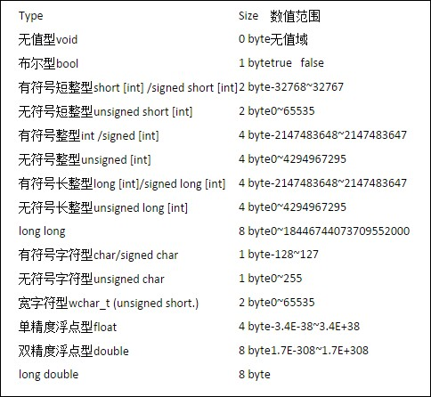
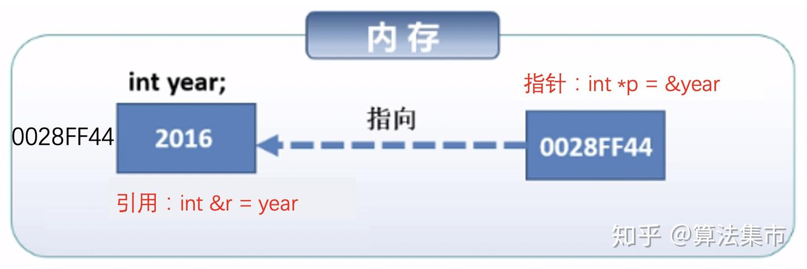
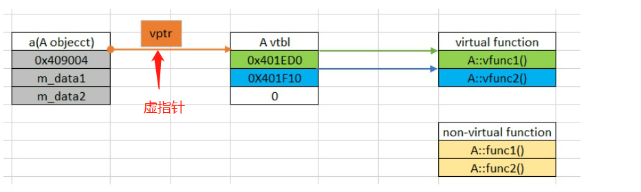
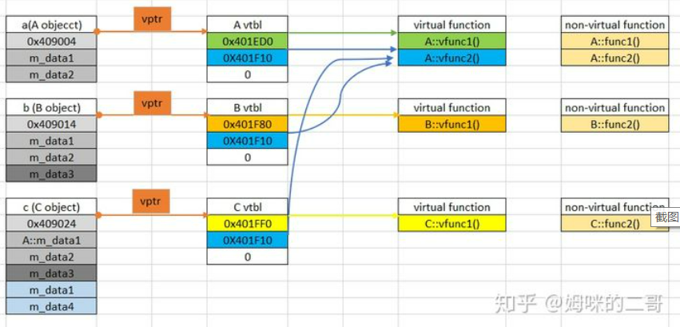

# 常见C++面试题及基本知识点总结

## **1. 结构体和共同体的区别。**

定义：

结构体struct：把不同类型的数据组合成一个整体，自定义类型。

共同体union：使几个不同类型的变量共同占用一段内存。

地址：

struct和union都有内存对齐，结构体的内存布局依赖于CPU、操作系统、编译器及编译时的对齐选项。

```
关于内存对齐，先让我们看四个重要的基本概念：
1.数据类型自身的对齐值：
对于char型数据，其自身对齐值为1，对于short型为2，对于int,float,double类型，其自身对齐值为4，单位字节。
2.结构体或者类的自身对齐值：其成员中自身对齐值最大的那个值。
3.指定对齐值：#pragma pack(n)，n=1,2,4,8,16改变系统的对齐系数
4.数据成员、结构体和类的有效对齐值：自身对齐值和指定对齐值中小的那个值。
```

### 常见数据类型及其长度：

注意long int和int一样是4byte，long double和double一样是8byte。（关于long double，ANSI C标准规定了double变量存储为 IEEE 64 位（8 个字节）浮点数值，但并未规定long double的确切精度。所以对于不同平台可能有不同的实现。有的是8字节，有的是10字节，有的是12字节或16字节。）

在标准c++中，int的定义长度要依靠你的机器的字长，也就是说，如果你的机器是32位的，int的长度为32位，如果你的机器是64位的，那么int的标准长度就是64位。经测试，在64位操作系统下，int的长度还是32位的。



从上面的一段文字中，我们可以看出，首先根据结构体内部成员的自身对齐值得到结构体的自身对齐值（**内部成员最大的长度**），如果没有修改系统设定的默认补齐长度4的话，取较小的进行内存补齐。

结构体struct：不同之处，stuct里每个成员都有自己独立的地址。sizeof(struct)是内存对齐后所有成员长度的加和。

共同体union：当共同体中存入新的数据后，原有的成员就失去了作用，新的数据被写到union的地址中。sizeof(union)是最长的数据成员的长度。

### 总结       
struct和union都是由多个不同的数据类型成员组成, 但在任何同一时刻, union中只存放了一个被选中的成员, 而struct的所有成员都存在。在struct中，各成员都占有自己的内存空间，它们是同时存在的。一个struct变量的总长度等于所有成员长度之和。在Union中，所有成员不能同时占用它的内存空间，它们不能同时存在。Union变量的长度等于最长的成员的长度。对于union的不同成员赋值, 将会对其它成员重写, 原来成员的值就不存在了, 而对于struct的不同成员赋值是互不影响的。

------

 

##  **2.static 和const分别怎么用，类里面static和const可以同时修饰成员函数吗。**

 static的作用：

对变量：

1.局部变量：

在局部变量之前加上关键字static，局部变量就被定义成为一个局部静态变量。

 1）内存中的位置：静态存储区

 2）初始化：局部的静态变量只能被初始化一次，且C中不可以用变量对其初始化，而C++可以用变量对其初始化。（详见：http://www.cnblogs.com/novice-dxx/p/7094690.html）

 3）作用域：作用域仍为局部作用域，当定义它的函数或者语句块结束的时候，作用域随之结束。

 注：当static用来修饰局部变量的时候，它就**改变了局部变量的存储位置（从原来的栈中存放改为静态存储区）及其生命周期（局部静态变量在离开作用域之后，并没有被销毁，而是仍然驻留在内存当中，直到程序结束，只不过我们不能再对他进行访问），但未改变其作用域。**

2.全局变量

在全局变量之前加上关键字static，全局变量就被定义成为一个全局静态变量。

1）内存中的位置：静态存储区（静态存储区在整个程序运行期间都存在）

2）初始化：未经初始化的全局静态变量会被程序自动初始化为0（自动对象的值是任意的，除非他被显示初始化）

3）作用域：全局静态变量在声明他的文件之外是不可见的。准确地讲从定义之处开始到文件结尾。

注：static修饰全局变量，**并未改变其存储位置及生命周期，而是改变了其作用域，使当前文件外的源文件无法访问该变量**，好处如下：（1）不会被其他文件所访问，修改（2）其他文件中可以使用相同名字的变量，不会发生冲突。**对全局函数也是有隐藏作用。**而普通全局变量只要定义了，任何地方都能使用，使用前需要声明所有的.c文件，只能定义一次普通全局变量，但是可以声明多次（外部链接）。注意：全局变量的作用域是全局范围，但是在某个文件中使用时，必须先声明。

对类中的：

　　　　1.成员变量

　　　　用static修饰类的数据成员实际使其成为类的全局变量，会被类的所有对象共享，包括派生类的对象。因此，**static成员必须在类外进行初始化(\**初始化格式： int base::var=10;)\**，而不能在构造函数内进行初始化，不过也可以用const修饰static数据成员在类内初始化 。**

　　　　特点：

1. 1. 不要试图在头文件中定义(初始化)静态数据成员。在大多数的情况下，这样做会引起重复定义这样的错误。即使加上#ifndef #define #endif或者#pragma once也不行。 
   2. 静态数据成员可以成为成员函数的可选参数，而普通数据成员则不可以。
   3. 静态数据成员的类型可以是所属类的类型，而普通数据成员则不可以。普通数据成员的只能声明为 所属类类型的指针或引用。

2.成员函数

1. 1. 用static修饰成员函数，使这个类只存在这一份函数，所有对象共享该函数，不含this指针。
   2. 静态成员是可以独立访问的，也就是说，无须创建任何对象实例就可以访问。base::func(5,3);当static成员函数在类外定义时不需要加static修饰符。
   3. 在静态成员函数的实现中不能直接引用类中说明的非静态成员，可以引用类中说明的静态成员。因为静态成员函数不含this指针。 

**不可以同时用const和static修饰成员函数。**

C++编译器在实现const的成员函数的时候为了确保该函数不能修改类的实例的状态，会在函数中添加一个隐式的参数const this*。但当一个成员为static的时候，该函数是没有this指针的。也就是说此时const的用法和static是冲突的。

我们也可以这样理解：两者的语意是矛盾的。**static的作用是表示该函数只作用在类型的静态变量上，与类的实例没有关系；而const的作用是确保函数不能修改类的实例的状态**，与类型的静态变量没有关系。因此不能同时用它们。

const的作用：

1.限定变量为不可修改。

2.限定成员函数不可以修改任何数据成员。

3.const与指针：

const char *p 表示 指向的内容不能改变。

char * const p，就是将P声明为常指针，它的地址不能改变，是固定的，但是它的内容可以改变。

------

 

##  **3.指针和引用的区别，引用可以用常指针实现吗。**

本质上的区别是，指针是一个新的变量，只是这个变量存储的是另一个变量的地址，我们通过访问这个地址来修改变量。

而引用只是一个别名，还是变量本身。对引用进行的任何操作就是对变量本身进行操作，因此以达到修改变量的目的。

```
(1)指针：指针是一个变量，只不过这个变量存储的是一个地址，指向内存的一个存储单元；而引用跟原来的变量实质上是同一个东西，只不过是原变量的一个别名而已。如：
int a=1;int *p=&a;
int a=1;int &b=a;
上面定义了一个整形变量和一个指针变量p，该指针变量指向a的存储单元，即p的值是a存储单元的地址。
而下面2句定义了一个整形变量a和这个整形a的引用b，事实上a和b是同一个东西，在内存占有同一个存储单元。
(2)可以有const指针，但是没有const引用（const引用可读不可改，与绑定对象是否为const无关）
(3)指针可以有多级，但是引用只能是一级（int **p；合法 而 int &&a是不合法的）
(4)指针的值可以为空，但是引用的值不能为NULL，并且引用在定义的时候必须初始化；
(5)指针的值在初始化后可以改变，即指向其它的存储单元，而引用在进行初始化后就不会再改变了。
(6)"sizeof引用"得到的是所指向的变量(对象)的大小，而"sizeof指针"得到的是指针本身的大小；
(7)指针和引用的自增(++)运算意义不一样；
```


```
指针传参的时候，还是值传递，试图修改传进来的指针的值是不可以的。只能修改地址所保存变量的值。
引用传参的时候，传进来的就是变量本身，因此可以被修改。
```

------

## **4.什么是多态，多态有什么用途。**

1. 定义：“一个接口，多种方法”，程序在运行时才决定调用的函数。
2. 实现：C++多态性主要是通过虚函数实现的，虚函数允许子类重写override(注意和overload的区别，overload是重载，是允许同名函数的表现，这些函数参数列表/类型不同）。

```
多态与非多态的实质区别就是函数地址是早绑定还是晚绑定。如果函数的调用，在编译器编译期间就可以确定函数的调用地址，并生产代码，是静态的，就是说地址是早绑定的。而如果函数调用的地址不能在编译器期间确定，需要在运行时才确定，这就属于晚绑定。
```

3.目的：**接口重用。**封装可以使得代码模块化，继承可以扩展已存在的代码，他们的目的都是为了代码重用。而多态的目的则是为了接口重用。

4.用法：声明基类的指针，利用该指针指向任意一个子类对象，调用相应的虚函数，可以根据指向的子类的不同而实现不同的方法。

补充一下关于重载、重写、隐藏（总是不记得）的区别：
```
Overload(重载)：在C++程序中，可以将语义、功能相似的几个函数用同一个名字表示，但参数或返回值不同（包括类型、顺序不同），即函数重载。
（1）相同的范围（在同一个类中）；
（2）函数名字相同；
（3）参数不同；
（4）virtual 关键字可有可无。
Override(重写)：是指派生类函数覆盖基类函数，特征是：
（1）不同的范围（分别位于派生类与基类）；
（2）函数名字相同；
（3）参数相同；
（4）基类函数必须有virtual 关键字。注：重写基类虚函数的时候，会自动转换这个函数为virtual函数，不管有没有加virtual，因此重写的时候不加virtual也是可以的，不过为了易读性，还是加上比较好。
Overwrite(隐藏)：隐藏，是指派生类的函数屏蔽了与其同名的基类函数，规则如下：
（1）如果派生类的函数与基类的函数同名，但是参数不同。此时，不论有无virtual关键字，基类的函数将被隐藏（注意别与重载混淆）。
（2）如果派生类的函数与基类的函数同名，并且参数也相同，但是基类函数没有virtual关键字。此时，基类的函数被隐藏（注意别与覆盖混淆）。
```
### 虚函数表、虚指针
​当一个类在实现的时候，如果存在一个或以上的虚函数时，那么这个类便会包含一张虚函数表。而当一个子类继承并重写了基类的虚函数时，它也会有自己的一张虚函数表。
当我们在设计类的时候，如果把某个函数设置成虚函数时，也就表明我们希望子类在继承的时候能够有自己的实现方式；如果我们明确这个类不会被继承，那么就不应该有虚函数的出现。
下面是某个基类A的实现：

```C++
class A {
public:
    virtual void vfunc1();
    virtual void vfunc2();
            void func1();
            void func2();
private:
    int m_data1, m_data1;
};

```
     
从下图中可以看到该类在内存中的存放形式，对于虚函数的调用是通过查虚函数表来进行的，每个虚函数在虚函数表中都存放着自己的一个地址，而如何在虚函数表中进行查找，则是通过虚指针来调用，在内存结构中它一般都会放在类最开始的地方，而对于普通函数则不需要通过查表操作。这张虚函数表是什么时候被创建的呢？它是在编译的时候产生，否则这个类的结构信息中也不会插入虚指针的地址信息。   
```C++
class A {
public:
    virtual void vfunc1();
    virtual void vfunc2();
            void func1();
            void func2();
private:
    int m_data1, m_data1;
};

class B : public A {
public:
    virtual void vfunc1();
            void func2();
private:
    int m_data3;
};

class C : public B {
public:
    virtual void vfunc1();
            void func2();
private:
    int m_data1, m_data4;
};
```
以下三个类在内存中的排布关系如下图所示：
    
- 对于非虚函数，三个类中虽然都有一个叫 func2 的函数，但他们彼此互不关联，因此都是各自独立的，不存在重载一说，在调用的时候也不需要进行查表的操作，直接调用即可。
- 由于子类B和子类C都是继承于基类A，因此他们都会存在一个虚指针用于指向虚函数表。**注意**，假如子类B和子类C中不存在虚函数，那么这时他们将共用基类A的一张虚函数表，在B和C中用虚指针指向该虚函数表即可。但是，上面的代码设计时子类B和子类C中都有一个虚函数 vfunc1，因此他们就需要各自产生一张虚函数表，并用各自的虚指针指向该表。由于子类B和子类C都对 vfunc1 作了重载，因此他们有三种不同的实现方式，函数地址也不尽相同，在使用的时候需要从各自类的虚函数表中去查找对应的 vfunc1 地址。
- 对于**虚函数 vfunc2**，两个子类都没有进行重载操作，所以基类A、子类B和子类C将共用一个 vfunc2，该虚函数的地址会分别保存在三个类的虚函数表中，但他们的地址是相同的。
- 从上图可以发现，在类对象的头部存放着一个虚指针，该虚指针指向了各自类所维护的虚函数表，再通过查找虚函数表中的地址来找到对应的虚函数。
- 对于类中的数据而言，子类中都会包含父类的信息。如上例中的子类C，它自己拥有一个变量 m_data1，似乎是和基类中的 m_data1 重名了，但其实他们并不存在联系，从存放的位置便可知晓。
### 构造函数不能是虚函数
从vptr角度解释：虚函数的调用是通过虚函数表来查找的，而虚函数表由类的实例化对象的vptr指针(vptr可以参考C++的虚函数表指针vptr)指向，该指针存放在对象的内部空间中，需要调用构造函数完成初始化。如果构造函数是虚函数，那么调用构造函数就需要去找vptr，但此时vptr还没有初始化！
### 析构函数可以且常常是虚函数
这个原理上就很好理解啦，因为此时 vtable 已经初始化了，完全可以把析构函数放在虚函数表里面来调用。C++类有继承时，析构函数必须为虚函数。如果不是虚函数，则使用时可能存在内存泄漏的问题。
## 什么是内存泄漏？面对内存泄漏和指针越界，你有哪些方法？
动态分配内存所开辟的空间，在使用完毕后未手动释放，导致一直占据该内存，即为内存泄漏。 方法：malloc/free要配套，对指针赋值的时候应该注意被赋值的指针是否需要释放；使用的时候记得指针的长度，防止越界        
## 简述类成员函数的重写、重载和隐藏的区别
（1）重写和重载主要有以下几点不同。
范围的区别：被重写的和重写的函数在两个类中，而重载和被重载的函数在同一个类中。
参数的区别：被重写函数和重写函数的参数列表一定相同，而被重载函数和重载函数的参数列表一定不同。
virtual的区别：重写的基类中被重写的函数必须要有virtual修饰，而重载函数和被重载函数可以被virtual修饰，也可以没有。   
（2）隐藏和重写、重载有以下几点不同。
与重载的范围不同：和重写一样，隐藏函数和被隐藏函数不在同一个类中。
参数的区别：隐藏函数和被隐藏的函数的参数列表可以相同，也可不同，但是函数名肯定要相同。当参数不相同时，无论基类中的参数是否被virtual修饰，基类的函数都是被隐藏，而不是被重写。
说明：虽然重载和覆盖都是实现多态的基础，但是两者实现的技术完全不相同，达到的目的也是完全不同的，覆盖是动态态绑定的多态，而重载是静态绑定的多态。
